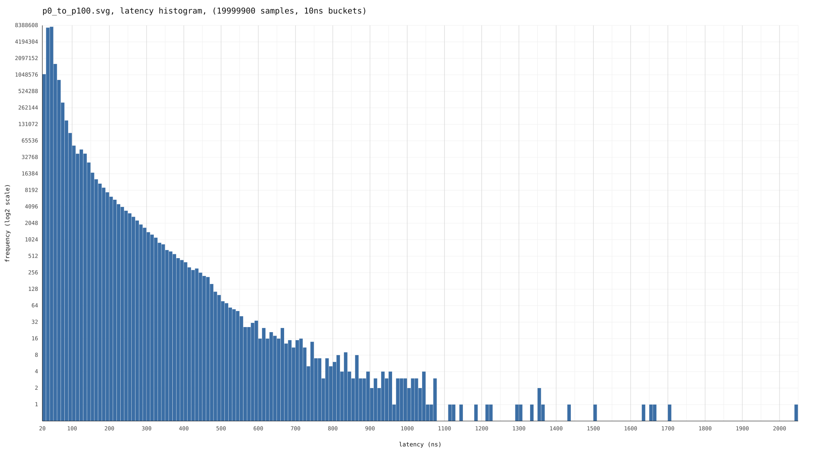
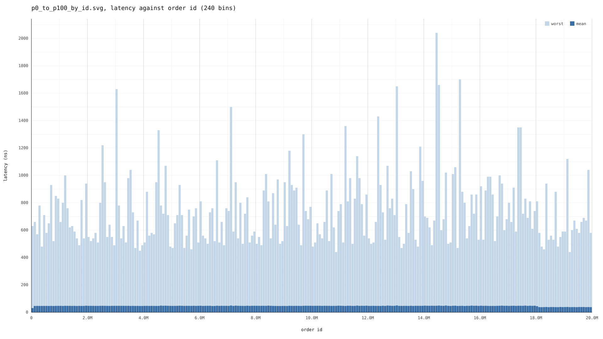
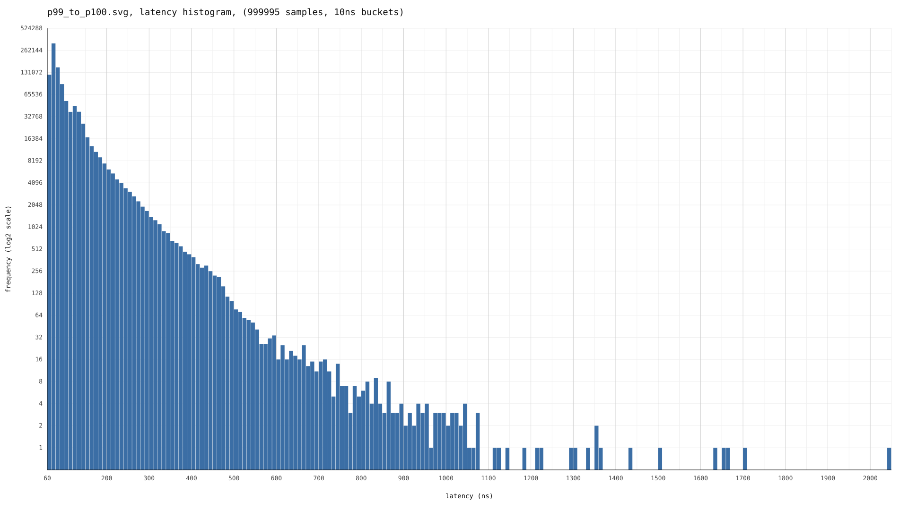
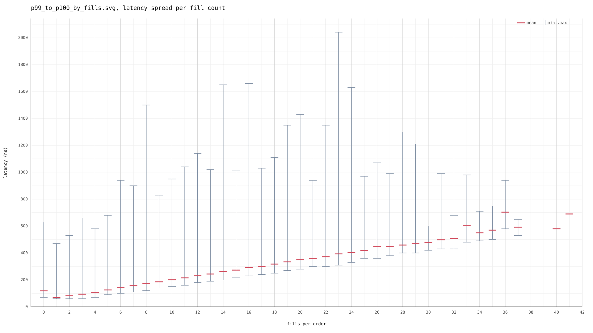
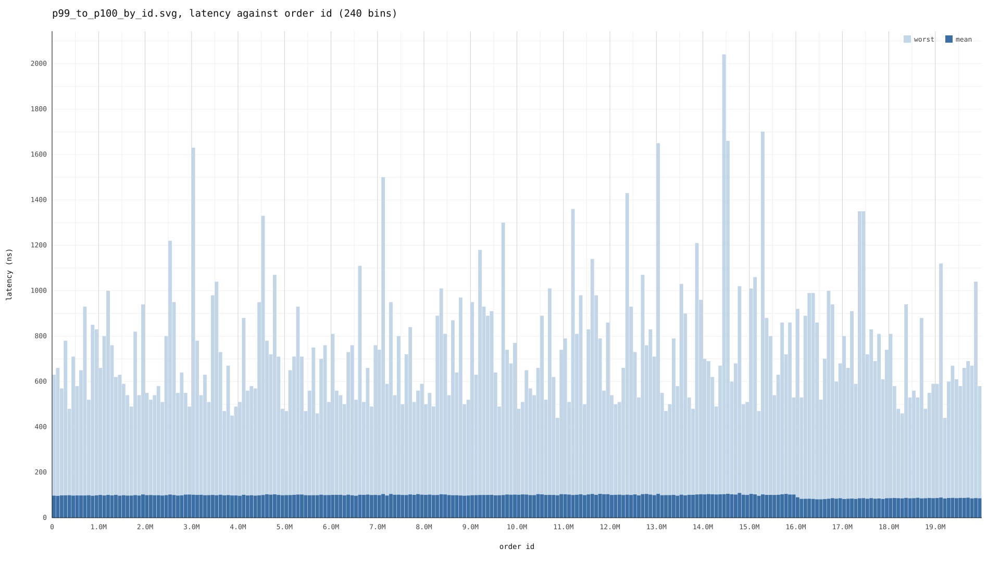
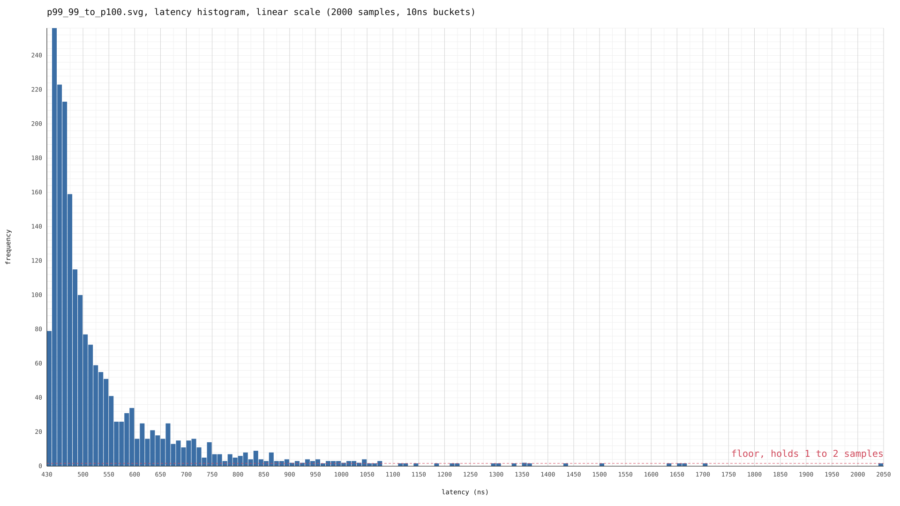
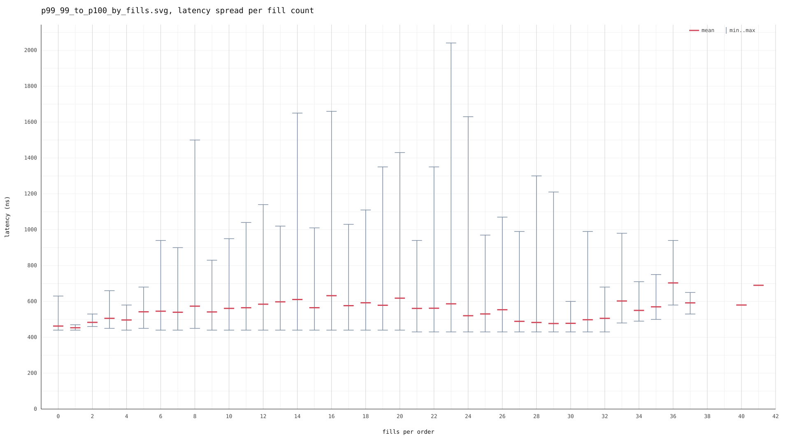
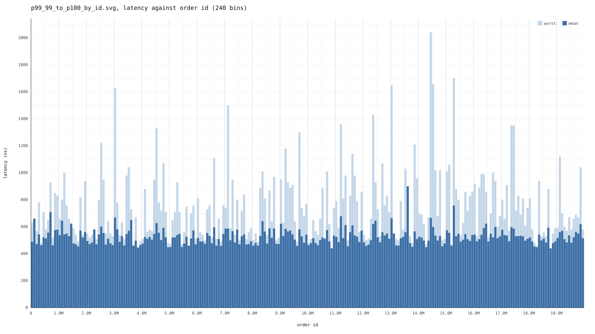

Sandbox for playing with cache, branches, allocation, and data structures (and some networking, but honestly that was mostly so I can benchmark it).

Effectively all of the interesting bits are in matcher.h and matcher.cpp.

### Numbers

Non-representative of a real workload because it's all synthetic data and uses some big hacks!
Such as cancellation map is really a vector as I have full control over the orderIDs and they're just a monotonically growing counter. Another one is that price ticks are always within 0-128 range, fulfilled orders are simply left in a buffer, etc. Overall this is more of a sandbox to play with different approaches and see the effects rather than something meant to be a working solution.

Currently it uses an arena monotonic allocator to allocate all of the state in hugepage backed memory ahead of time and then the hot path is all zero-allocation.

The book is a tick-indexed array with each element holding the maximum amount of nodes for a price. Each tick level is modelled as an intrusive linked list. Each level has its own pool of nodes it recycles so it does not fragment across all the levels as time goes on.

Overall, these numbers are not representative of anything, but it has been fun to see them move up and down by changing the design.

If you are interested:

Numbers captured on an `isolcpus nohz_full` core locked at 2.9GHz hyperthreading off, on Ryzen 7 4800H (Zen 2)
First 100 entries ignored to warm up caches and BTB.

Due to RDTSC limitations (reciprocal throughput of 37 cycles on Zen 2), only the tail shows useful data (as sub-50ns workloads can't be measured very accurately). These are numbers captured with lfence, rdtsc on one end and and rdtscp on the other, with no accounting for rdtsc latency as there is no information what that is.


```
g++-14 -O3 -DNDEBUG -march=native -ffast-math -flto

20 million orders

p99.999, idx 19999700: 710ns
p99.99, idx 19997900: 430ns
p99.9, idx 19979900: 250ns
p99, idx 19799901: 120ns
p95, idx 18999905: 60ns
p50, idx 9999950: 40ns
last: 1791ns
executed_limits: 10000471, resting_crosses: 13995, fully_filled_crosses: 495918, resting: 9504553
no ops (aggressive order found the opposite side empty): 2
executed_markets: 1200056
executed_cancels: 8799473, of which not found (already filled): 1112340
book state: ask: 54, bid: 52
book width at the end: asks: 20884, bids: 7418
```

# Plots

The plots.cpp and plots.h files are AI generated as I just wanted something to see visually but didn't care enough to spend time learning how to write svgs by hand.

## p0 to p100





## p99 to p100

### NOTE: frequency scale here is logarithmic.





## p99.99 to p100

### NOTE: frequency scale here is linear.





### Some napkin analysis

Some `perf` numbers are at the bottom of this readme.

There are no interrupts or any machine effects that I could identify, as the results are fairly reproducible (within 10-20% of the slowest value) and perf also confirms it. Also there are no allocations on the hot path. So here we should be limited mostly by branch predictor and cache effects.

From the _by_id graph, we can see that Order IDs grow monotonically, so we can see that fragmentation over time is not a _major_ reason for latency spikes (although we might need more data to confirm this to some degree as it looks like the largest anomalies are on the right, although anomalies overall don't look to be much more common on the right).

From the _by_fills graph, We can see that with more filled orders, the mean latency grows pretty linearly, which is expected. But the latency spikes are only somewhat correlated to fills per order.

This leaves us with likely the main culprit - cache misses in deep-sweeping orders that match on cold cache entries. This is an issue of the intrusive linked list as fetching subsequent orders is dependent on each earlier one, so basically pointer chasing into DRAM... ouch! I would like to investigate ways to fix this by prefetching the head of adjacent tick levels periodically, or a different layout altogether for the levels so I can make more use of memory level parallelism (and also ILP as right now everything is data-bottlenecked). To do this properly, however, would mean that I first need to implement an actual data feed with proper real life constraints as right now everything is in a tight loop and using pretty hacky conditions. This is the main TODO but it is not trivial.


### To run

A bit janky as of right now, but first build and run `market_generator` - it creates the market in shared memory and gives you how to attach from the main exchange. Reason for this is because I wanted to do IPC for this.

```
$ ./market_generator <seed> 
attach with: ./exchange /proc/390268/fd/3   (15000000 requests, 960495616 bytes)
generated 15000000 requests: 10001148 orders, 4998852 cancels

```

### TODOs

1. Implement a proper protocol so I can test against a real market feed and profile end-to-end properly (currently only synthetic data)
2. SPSC directly in shared memory rather than app-side
3. Only 128 tick levels right now mimicking a spread, handle colder orders and movement of the spread
4. More symbols and stop order book
5. Fix up fulfilled orders
6. Address code TODOs

Notes for myself here-on-after:


## Profiling with Clang XRay

XRay is a Clang instrumentation framework that inserts lightweight probes at function entry/exit for precise latency tracing.

### Build with XRay enabled
```bash
cmake -S . -B build -DENABLE_XRAY=ON -DCMAKE_BUILD_TYPE=RelWithDebInfo
cmake --build build
```

### Collect a trace
```bash
XRAY_OPTIONS="patch_premain=true xray_mode=xray-basic verbosity=1" ./src/exchange
```
This produces a binary log file named `xray-log.exchange.<PID>`.

### Analyse the trace
```bash
# Table of function timings sorted by median duration (descending)
llvm-xray account xray-log.exchange.* --instr_map=./src/exchange --sort=med --sortorder=dsc

# Or export to Chrome/Perfetto trace format for a visual flame chart
llvm-xray convert --symbolize --instr_map=./src/exchange --output-format=trace_event xray-log.exchange.* > trace.json
```
Open `trace.json` in `chrome://tracing` or [Perfetto UI](https://ui.perfetto.dev/).


### perf 

overall
```
$ perf stat -e cycles,instructions,branches,branch-misses ./exchange /proc/4536/fd/3
running on CPU 8

 Performance counter stats for './exchange /proc/4536/fd/3':

     4,332,279,651      cycles                                                                
     2,703,745,705      instructions                     #    0.62  insn per cycle            
       255,691,406      branches                                                              
        16,106,823      branch-misses                    #    6.30% of all branches           

       1.504334391 seconds time elapsed

       1.357580000 seconds user
       0.146190000 seconds sys
```

branching
```
$ perf stat -e cycles,ex_ret_brn,ex_ret_brn_misp,ex_ret_brn_tkn_misp,ex_ret_brn_ind_misp,bp_de_redirect ./exchange /proc/4536/fd/3
running on CPU 8

 Performance counter stats for './exchange /proc/4536/fd/3':

     4,329,875,079      cycles                                                                  (99.94%)
       255,695,148      ex_ret_brn                                                            
        16,106,989      ex_ret_brn_misp                                                       
         8,600,047      ex_ret_brn_tkn_misp                                                   
         2,517,469      ex_ret_brn_ind_misp                                                   
             7,419      bp_de_redirect                                                          (99.97%)

       1.502411618 seconds time elapsed

       1.356601000 seconds user
       0.143608000 seconds sys
```

cache
```
$ perf stat -e cycles,L1-dcache-loads,L1-dcache-load-misses,l2_cache_req_stat.ls_rd_blk_c,l2_request_g1.rd_blk_l ./exchange /proc/4536/fd/3
running on CPU 8

 Performance counter stats for './exchange /proc/4536/fd/3':

     4,330,236,860      cycles                                                                
     1,536,303,108      L1-dcache-loads                                                       
        81,687,982      L1-dcache-load-misses            #    5.32% of all L1-dcache accesses 
        11,379,483      l2_cache_req_stat.ls_rd_blk_c                                         
        57,866,851      l2_request_g1.rd_blk_l                                                

       1.504909973 seconds time elapsed

       1.358853000 seconds user
       0.146023000 seconds sys
```

tlb

```
$ perf stat -e cycles,dTLB-loads,dTLB-load-misses ./exchange /proc/4536/fd/3
running on CPU 8

 Performance counter stats for './exchange /proc/4536/fd/3':

     4,334,671,251      cycles                                                                
            12,356      dTLB-loads                                                            
             3,749      dTLB-load-misses                 #   30.34% of all dTLB cache accesses

       1.505981684 seconds time elapsed

       1.358920000 seconds user
       0.147095000 seconds sys
```

page faults and context switching
```
$ perf stat -e context-switches,cpu-migrations,page-faults,minor-faults,major-faults ./exchange /proc/4536/fd/3
running on CPU 8

 Performance counter stats for './exchange /proc/4536/fd/3':

                 1      context-switches                                                      
                 1      cpu-migrations                                                        
               132      page-faults                                                           
               132      minor-faults                                                          
                 0      major-faults                                                          

       1.504178081 seconds time elapsed

       1.357796000 seconds user
       0.145944000 seconds sys
```